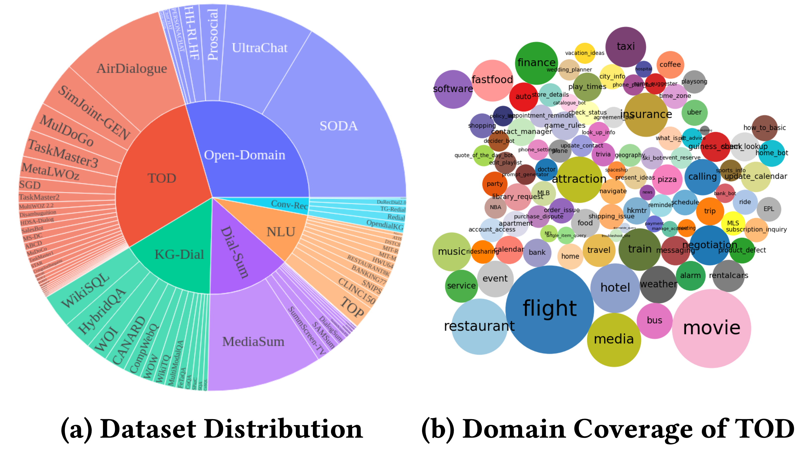

<p align="center">
    <br>
    
    <br>
<!-- <p>
<div align="center"> -->
<a href="https://arxiv.org/abs/2307.10172" style="font-size:20px;">Paper</a>,
<a href="https://huggingface.co/datasets/Salesforce/dialogstudio" style="font-size:20px;">Huggingface</a>,
<a href="#model" style="font-size:20px;">Model</a>,
<a href="https://twitter.com/JianguoZhang3" style="font-size:20px">Twitter</a> 
<!-- </div> -->
<p>

# DialogStudio: Towards Richest and Most Diverse Unified Dataset Collection and Instruction-Aware Models for Conversational AI

## News!

* [Upload models] Aug 18, 2023. We upload version 1.0 models ([dialogstudio-t5-base-v1.0](https://huggingface.co/Salesforce/dialogstudio-t5-base-v1.0), [dialogstudio-t5-large-v1.0](https://huggingface.co/Salesforce/dialogstudio-t5-large-v1.0), [dialogstudio-t5-3b-v1.0](https://huggingface.co/Salesforce/dialogstudio-t5-3b-v1.0)) trained on a few selected DialogStudio datasets.
* [Version 1.0.1] Aug 1, 2023.  We resolved minor issues in a few dialogues, added prompts for selected knowledge-grounded datasets, removed requirements for HuggingFace login, and made updates to SODA and ShareGPT datasets.
* [Initial Release] July 2023. We're thrilled to the initial release of the largest unified Dialog dataset collection. The full list of all available datasets is [here](./Dataset_Stats.csv).  


## Contents

- [Introduction](#introduction)
- [Loading Data](#loading-data)
- [Datasets](#datasets)
- [Model](#model)
- [License](#license)
- [Citation](#citation)

## Introduction

<!-- Check [DialogStudio_datasets.csv](https://docs.google.com/spreadsheets/d/10U9I4GoHFTYxl3OlzbbV0gmXerMT9Itn2MZs8t6AIK0/edit#gid=461625820) for all supported datasets. -->
DialogStudio is a large collection and unified dialog datasets. 
The figure below provides a summary of the general statistics associated with DialogStudio. DialogStudio unified each dataset while preserving its original information, and this aids in supporting research on both individual datasets and Large Language Model (LLM) training. The full list of all available datasets is [here](./Dataset_Stats.csv).

The data are downloadable through Huggingface as introduced in [Loading Data](#loading-data). We also provide examples for each dataset in this repo. For more granular and category-specific details, please refer to the individual folders corresponding to each category within the DialogStudio collection, e.g. [MULTIWOZ2_2](./task-oriented-dialogues/MULTIWOZ2_2/) dataset under the [task-oriented-dialogues](./task-oriented-dialogues/) category. 
<p align="center">
    <br>
    
    <br>
<p>

DialogStudio evaluates dialogue quality based on six critical criteria, namely Understanding, Relevance, Correctness, Coherence, Completeness, and Overall Quality. Each criterion is scored on a scale of 1 to 5, with the highest scores reserved for exceptional dialogues.

Given the vast number of datasets incorporated into DialogStudio, we utilized 'gpt-3.5-turbo' to assess 33 distinct datasets. The corresponding script used for this evaluation can be accessed through the [link](https://github.com/salesforce/DialogStudio/blob/main/code/openai_dialog_quality_evaluation.py). 

The results of our dialogue quality assessment are presented below. We intend to release evaluation scores for individually selected dialogues in the upcoming period.
<p align="center">
    <br>
    
    <br>
<p>


## Loading Data

You can load any dataset in the DialogStudio from the [HuggingFace hub](https://huggingface.co/datasets/Salesforce/dialogstudio) by claiming the `{dataset_name}`, which is exactly the dataset folder name. All available datasets are described in [dataset content](./Dataset_Stats.csv).

Below is one example to load the [MULTIWOZ2_2](./task-oriented-dialogues/MULTIWOZ2_2/) dataset under the [task-oriented-dialogues](./task-oriented-dialogues/) category:

<!-- Agree Licenses on the [HuggingFace hub](https://huggingface.co/datasets/Salesforce/dialogstudio). Ensure you're also logged into your HuggingFace account on local. If you haven't logged in yet, you can do so by running the following command in your terminal:
```python
huggingface-cli login
``` -->

Load the dataset
```python
from datasets import load_dataset

dataset = load_dataset('Salesforce/dialogstudio', 'MULTIWOZ2_2')
```
Here is the output structure of MultiWOZ 2.2
```python
DatasetDict({
    train: Dataset({
        features: ['original dialog id', 'new dialog id', 'dialog index', 'original dialog info', 'log', 'prompt', 'external knowledge non-flat', 'external knowledge', 'dst knowledge', 'intent knowledge'],
        num_rows: 8437
    })
    validation: Dataset({
        features: ['original dialog id', 'new dialog id', 'dialog index', 'original dialog info', 'log', 'prompt', 'external knowledge non-flat', 'external knowledge', 'dst knowledge', 'intent knowledge'],
        num_rows: 1000
    })
    test: Dataset({
        features: ['original dialog id', 'new dialog id', 'dialog index', 'original dialog info', 'log', 'prompt', 'external knowledge non-flat', 'external knowledge', 'dst knowledge', 'intent knowledge'],
        num_rows: 1000
    })
})
```
 

## Datasets

The datasets are split into several categories in this GitHub repository and [HuggingFace hub](https://huggingface.co/datasets/Salesforce/dialogstudio). You can check the [table of dataset](./Dataset_Stats.csv) for more information. And you can click into each folder to check a few examples:

- [Knowledge-Grounded-Dialogues](./knowledge-grounded-dialogues/)
- [Natural-Language-Understanding](./natural-language-understanding/)
- [Open-Domain-Dialogues](./open-domain-dialogues/)
- [Task-Oriented-Dialogues](./task-oriented-dialogues/)
- [Dialogue-Summarization](./dialogue-summarization/)
- [Conversational-Recommendation-Dialogs](./conversational-recommendation-dialogues/)

<!-- ```
Datasets/
├── Knowledge-Grounded-Dialogues
├── Natural-Language-Understanding
├── Open-Domain-Dialogues
├── Task-Oriented-Dialogues
├── Dialogue-Summarization
├── Conversational-Recommendation-Dialogs
``` -->


## Model

We've rolled out version 1.0 of models ([dialogstudio-t5-base-v1.0](https://huggingface.co/Salesforce/dialogstudio-t5-base-v1.0), [dialogstudio-t5-large-v1.0](https://huggingface.co/Salesforce/dialogstudio-t5-large-v1.0), [dialogstudio-t5-3b-v1.0](https://huggingface.co/Salesforce/dialogstudio-t5-3b-v1.0)) trained on a few selected DialogStudio datasets. Check each [Model Card](https://huggingface.co/Salesforce/dialogstudio-t5-base-v1.0) for more details. 

Below is one example for running model on CPU:

```python
from transformers import AutoTokenizer, AutoModelForSeq2SeqLM

tokenizer = AutoTokenizer.from_pretrained("Salesforce/dialogstudio-t5-base-v1.0")
model = AutoModelForSeq2SeqLM.from_pretrained("Salesforce/dialogstudio-t5-base-v1.0")

input_text = "Answer the following yes/no question by reasoning step-by-step. Can you write 200 words in a single tweet?"
input_ids = tokenizer(input_text, return_tensors="pt").input_ids

outputs = model.generate(input_ids, max_new_tokens=256)
print(tokenizer.decode(outputs[0], skip_special_tokens=True))
```

Note: 

Version 1.0 is built on small-scale pre-trained models, this version does not incorporate datasets utilized for training large-scale models (>=7B) like Alpaca, ShareGPT, GPT4ALL, UltraChat from OpenAI's 'GPT-3.5/4', or other datasets such as OASST1 and WizardCoder.  As a result, it has certain limitations in terms of writing and creative capabilities. Our initial focus is to update the model versions to enhance existing abilities. Further improvements, including expansion of other capabilities, are part of our roadmap and will be responsive to community requests.


## License

Our project follows the following structure with respect to licensing:

1. For all the modified datasets in DialogStudio: 
   - A portion of these datasets is under the [Apache License 2.0](LICENSE.txt).
   - Some retain their original licenses even after modification.
   - For a few datasets that lacked a license, we have cited the relevant papers.
2. Original dataset licenses: For reference, we also put the originally available licenses for each dataset into their respective dataset folders.
3. Code: Our codebase is under the [Apache License 2.0](LICENSE.txt).

For detailed licensing information, please refer to the specific licenses accompanying the original datasets. It is important to familiarize yourself with these terms as we do not assume responsibility for licensing issues.

## Acknowledgement
We sincerely thank all dataset authors who have contributed to the Conversational AI field. Despite careful efforts, inaccuracies in our citations or references may occur. If you spot any errors or omissions, please raise an issue or submit a pull request to help us improve. Thank you!

## Citation

The data and code in this repository is mostly developed for or derived from the paper below. If you utilize datasets from DialogStudio, we kindly request you cite both the original work and our own.

```
@misc{zhang2023dialogstudio,
      title={DialogStudio: Towards Richest and Most Diverse Unified Dataset Collection for Conversational AI}, 
      author={Jianguo Zhang and Kun Qian and Zhiwei Liu and Shelby Heinecke and Rui Meng and Ye Liu and Zhou Yu and and Huan Wang and Silvio Savarese and Caiming Xiong},
      year={2023},
      eprint={2307.10172},
      archivePrefix={arXiv},
      primaryClass={cs.CL}
}
```

## Contribution

We enthusiastically invite contributions from the community! Join us in our shared mission to propel the field of conversational AI forward!
